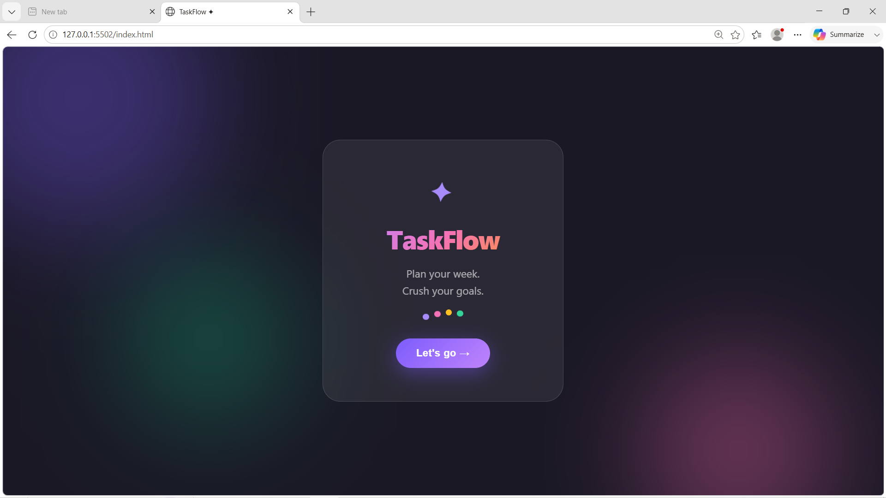
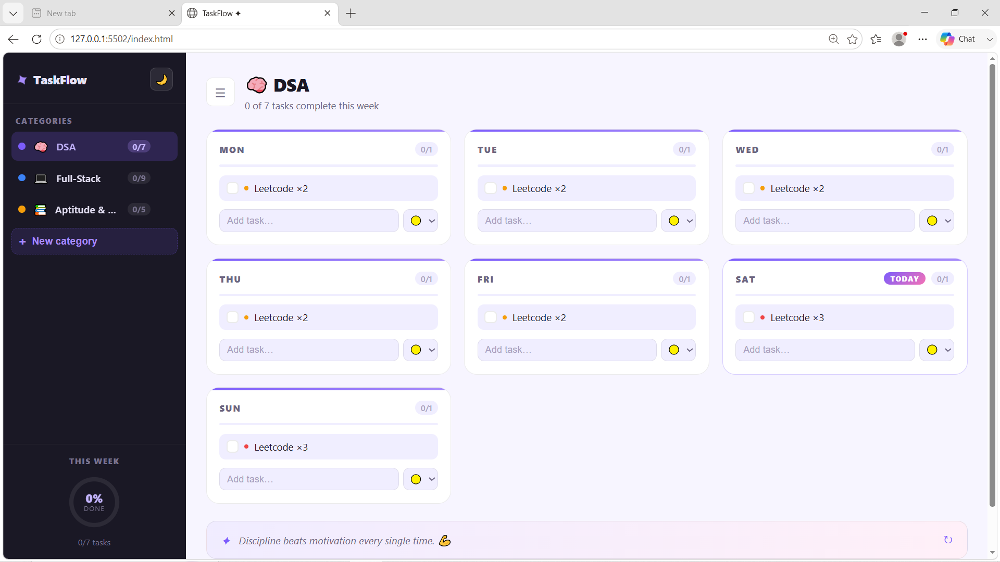
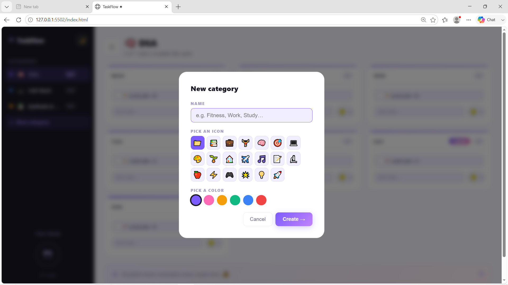

# ✅ To-Do Weekly Planner

A fully responsive, client-side **To-Do List Web App** built using **HTML, CSS, and JavaScript**. Plan your entire week by adding categories and managing daily tasks with ease and style!

---

## 🚀 Features

- 🗂️ **Category System** – Add, select, and delete task categories like DSA, Full-Stack, Aptitude, etc.
- 📆 **7-Day Week Planner** – Each category has its own daily task schedule from Monday to Sunday.
- ➕ **Task Management** – Add and remove tasks for each day easily.
- 📱 **Responsive Design** – Mobile-friendly layout for any screen size.
- 🌈 **Modern UI** – Smooth shadows, rounded corners, and soft colors.
- 💬 **Motivational Quote** – Encouragement built right into the UI!

---

## 📁 Project Structure

TO_DO_PLANNER/
├── index.html  
├── style.css  
├── script.js  
└── README.md  

---

### 📌🖥️ Welcome Screen

### 📋 Category Section

---

## 💻 Tech Stack

- **HTML5** – Page structure and semantic layout  
- **CSS3** – Styling, grid/flex layouts  
- **JavaScript** – Dynamic DOM rendering, category/task logic 

---

## 🧠 How it works?

- Start on the **Welcome Screen** and click **Next ➔**.
- Add a category by clicking **+ Add Category** (e.g., DSA, Aptitude, Full-Stack, Gym).
- Use the ❌ icon to delete a category entirely.
- Click on a category to open its **This Week** (weekly view).
- Type and enter on **Add task...** to add tasks under each day.
- Remove tasks by clicking **❌** beside them.
- Stay motivated with the built-in **quote** at the bottom!
